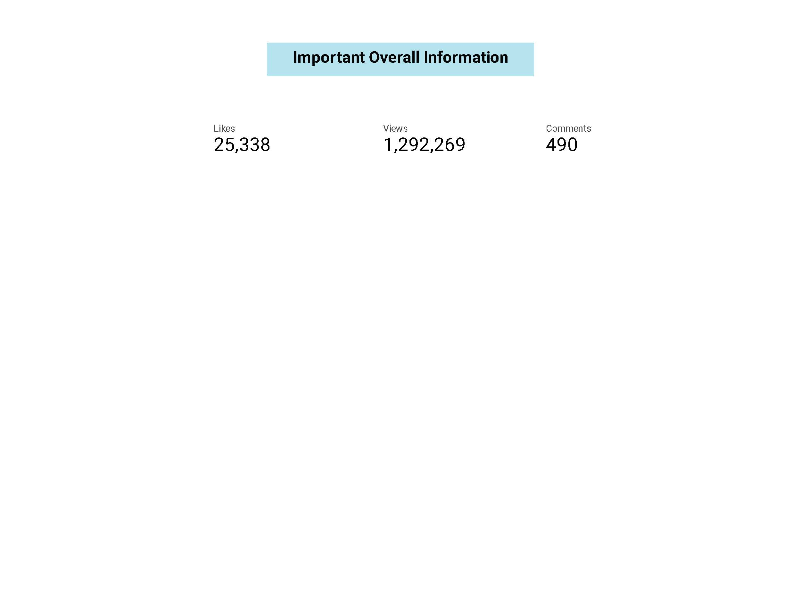

# Googlel Lookout Studio 

Import data from bigquery


Connect the Google sheet data merge table together
```
Resource -> Manage added data sources -> ADD A DATA SOURCE -> Google Sheet
SELECT chart -> BLEND DATA -> Choose Dimensions & Metrics -> Join Another Table -> Choose Table -> Choose Join Inner Join
```


Write a case statement to categorize fun and tips content as one category, others as a seperate category
```
Resource -> Manage added data sources -> EDIT -> ADD A FIELD -> ADD calculated field
CASE WHEN Category_Id IN (1,4) THEN "Fun_tips" 
ELSE 'OTHER'
END
```

Observe trends in platfroms & categories
```
INSERT table -> Add Metric -> ADD Field -> Formula to calculate new value
Chart -> style -> Metric 1 -> Decorate the data with heatmap . bar/pub
```


Social Media report produced using Google Lookout Studio




